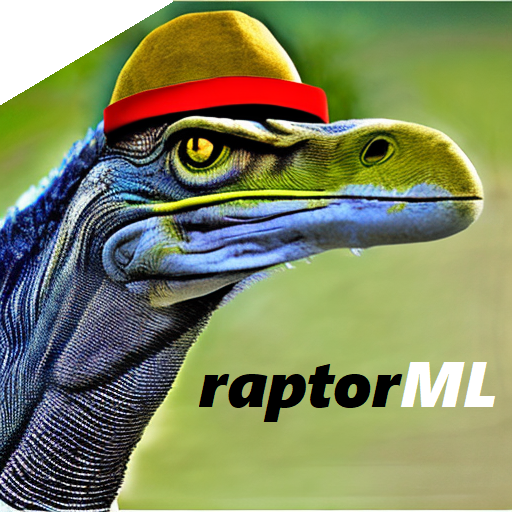

<!-- README.md is generated from README.Rmd. Please edit that file -->

```{r, include = FALSE}
knitr::opts_chunk$set(
  collapse = TRUE,
  comment = "#>",
  fig.path = "man/figures/README-",
  out.width = "100%"
)
```

# raptorML 

<!-- badges: start -->
[](https://github.com/captnmarkus/raptorML/actions)
<!-- badges: end -->

## Overview

The goal of raptorML is to streamline the process of setting up machine learning projects by automating the creation of a well-organized project structure. The package asks for a project name and swiftly establishes a new directory structure for your project. Furthermore raptorML takes care of the data ingestion and executing of your code by providing production ready capabilities

This package is designed with the aim of enhancing reproducibility, efficiency, and code re-usability in machine learning projects, helping you to focus on what's important - building and refining your machine learning models.

Functions:

* `forge()` Creates a directory structure and files for a data science project.
* `catalog_load()` Loads a catalog file that contains metadata about the data sources used in a data science project.
* `orchestrate()` Manages and coordinates the execution of different steps in the data processing pipeline.


## Installation

To get a bug fix or to use a feature from the development version, you can install the development version of raptorML from GitHub.

``` r
# library(devtools)
# devtools::install_github("captnmarkus/raptorML")
```

## Usage

As raptor ML create folder structures we cant compile code here directly.
However after a quoted example code an image of the project structure should give you an intuition.

``` r
# forge()
## creates a folder structure for data science projects and example is in the tests folder
```

## Getting help

If you encounter a clear bug, please file an issue with a minimal reproducible example on [GitHub](https://github.com/raptorML/issues).
