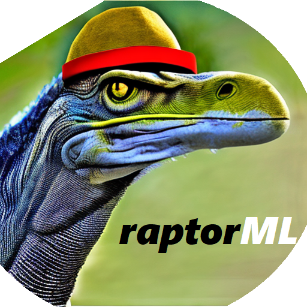

<!-- README.md is generated from README.Rmd. Please edit that file -->

# raptorML 

<!-- badges: start -->
<!-- badges: end -->

The goal of raptorML is to streamline the process of setting up machine
learning projects by automating the creation of a well-organized project
structure. The package asks for a project name and swiftly establishes a
new directory structure for your project. This includes core directories
like ‘conf’, ‘data’, ‘docs’, ‘logs’, ‘notebooks’, and ‘src’.

Within the ‘conf’ directory, it creates ‘base’ and ‘credentials’
subdirectories. For the ‘data’ directory, it provides ‘00_sql_files’,
‘01_raw’, ‘02_processed’, and ‘03_model_ready’ subdirectories. These
predefined structures help ensure consistent and organized management of
your machine learning assets.

The package also takes care of creating essential YAML files. This
includes a ‘catalog.yaml’ and ‘parameters.yaml’ in the ‘conf/base’
directory, along with a ‘credentials.yaml’ in the ‘conf/credentials’
directory. These files lay the groundwork for managing your data
catalog, parameters, and credentials respectively.

Lastly, to facilitate project-level documentation and reproducibility,
raptorML creates a ‘Readme.md’ file and an Rproj file, named after your
project, in the root directory of the project.

This package is designed with the aim of enhancing reproducibility,
efficiency, and code reusability in machine learning projects, helping
you to focus on what’s important - building and refining your machine
learning models.

## Installation

You can install the development version of raptorML like so:

``` r
# FILL THIS IN! HOW CAN PEOPLE INSTALL YOUR DEV PACKAGE?
```

## Example

This is a basic example which shows you how to solve a common problem:

``` r
library(raptorML)
## basic example code
```
